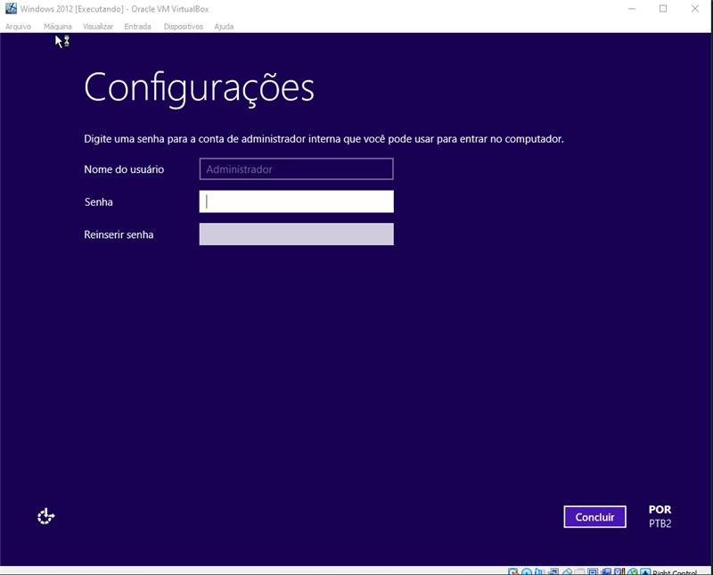

# Passo a passo para instalação do Windows 2012.

 ## Passo 1
 * Assim que você iniciar o seu Windows, ele ira te dar as opções de ***idiomas*** como visto na imagem a seguir:

    

## Passo 2
* Após seçecionar o idioma da sua preferência, basta clicar em ***Instalar agora***. Caso o se Windows estiver com algum problema, é só clicar na opção ***Reparar Computador***, como na imagem:

     

## Passo 3
* Neste passo, você irá selecionar qual o tipo de ***""sistema operacional"*** que deseja, como exemplo, a segunda opção da imagem (*"Windows Server 2012 R2 Standard (Servidor com GUI)"*) ela teria uma interface gráfica (**GUI**), enqunto a primeira opção seria só linhas de codigos interativos. Para melhores informações, basta ler a descrição de cada um, logo em baixo da caixa de escolha. Após isso, clique em **"Avançar"**, segue as imagens:

     

    

## Passo 4
* Neste passo passa basta aceitar os termos de licença e clicar em **"Avançar"**.

    

## Passo 5
* Aqui você tem que clicar em personalizada, pois você quer instalar o Windows e não atualizar ele! Segue a imagem:

    

## Passo 6
* Neste passo você vai dividir o seu HD para que o windows tenha o seu própio espaço! Para fazer isso clique em *"☀️Novo"* e digite a quantidade que quer para aquele *"novo"* espaço. Depois, clique no novo espaço criado, ou como na imagem "Unidade 0 Partição 2", e avançe!
 
    

    

## Passo 7
* Nesta parte, basta esperar como na imagem:

    

Após aguardar, o computador será reiniciado!

## Passo 8
* Nesse passo é simples, pois basta criar uma senha para seu computador, porém, por ser um sistema operacional para servidor, a senha tem que ser rigida!

    

## Passo 9
* Neste passo, clique no host (Ctrl direito do teclado) + Delete, e digite sua senha!

    

    

## Passo 10
* E pronto, seu Windows Server 2012 está pronto para uso!

    